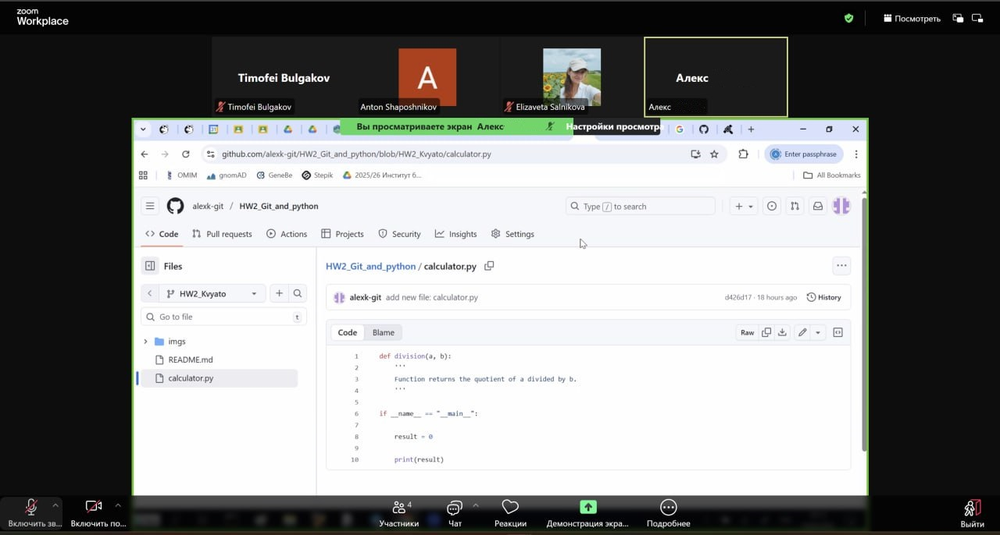

# HW2_Git_and_python: Сalculator Project

A simple command-line calculator that evaluates mathematical expressions with two operands and one operator.

### 🚀 Features
- Supports four basic arithmetic operations: addition, subtraction, multiplication and division;
- Handles both integer and floating-point numbers;
- Clean, modular code structure with separate functions for each operation;
- Input validation for space-separated format and removes backspace symbol;

### 📋 Input Format
The program accepts expressions in the format:

`<number><space><operator><space><number>`

All elements must be separated by spaces.
Example: `5 - 3` or `10.5 * 2.0`!

### 🛠️ Core Functions
- **`main()`** - мain function that handles input parsing, operation routing, and result output;
- **`addition(a, b)`** - addition operation;
- **`subtraction(a, b)`** - subtraction operation;
- **`multiplication(a, b)`** - multiplication operation;
- **`division(a, b)`** - division operation;

### 👨‍💻 Team Structure
- **Team Lead**: alexk-git
- **Addition**: lvsea00
- **Subtraction**: KuchukLambat
- **Multiplication**: Tim-Bulgakov
- **Division & Main**: alexk-git

### 📦 Usage

1. Run the program:
```bash
$ python3 calculator.py
I can calculate one of four operations "+ - * /" on two numbers.
Please, enter your expression as 'a <operator> b': 123 + 345
Result of 123 + 345 = 468.0
```

### ⚠️ Notes
- Input must follow the exact format with spaces between elements;
- Division by zero is handled by Python's built-in exception handling;
- Python version 3.12.3
- Supports both integers and floating-point numbers;

### 👥 Team Collaboration

For effective collaboration and coordination, the team utilized the following communication platforms:
- **Telegram**: For daily stand-ups, quick discussions, and task coordination:
  
  
- **Zoom**: For weekly team meetings, code reviews, and planning sessions:
  

